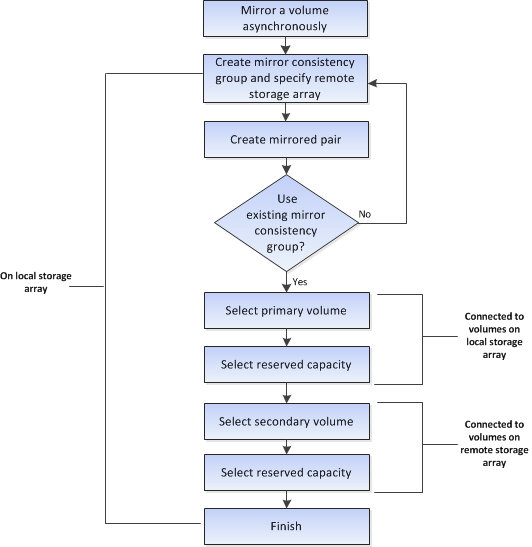
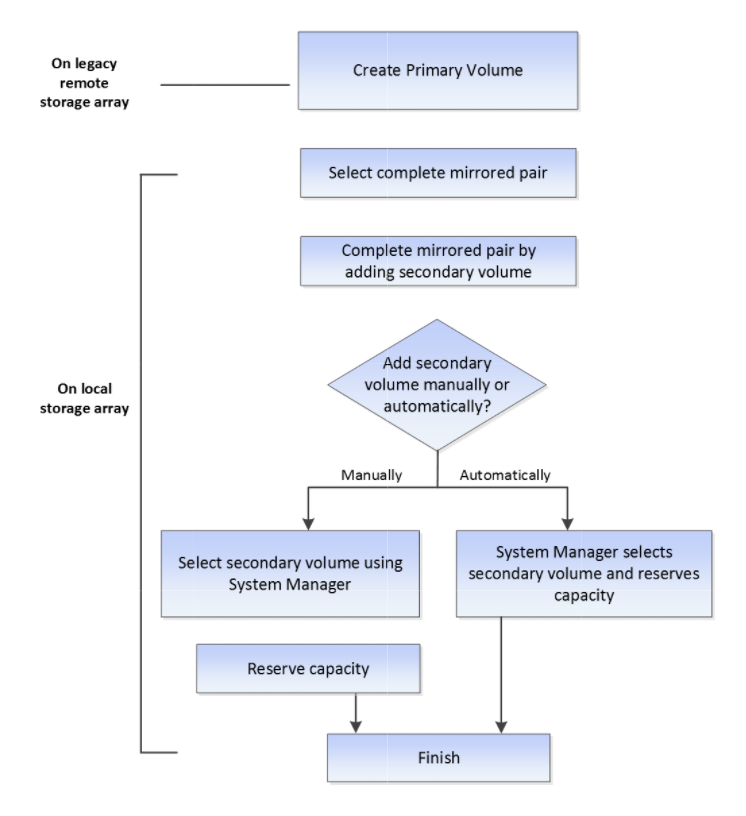

= 非同步鏡射磁碟區的工作流程
:allow-uri-read: 
:icons: font
:imagesdir: ../media/

[role="lead"]
在System Manager中、您可以依照下列步驟、以非同步方式鏡射磁碟區。

== 工作流程：在未使用System Manager管理的舊系統上、為主要磁碟區完成鏡射配對

如果您在未使用System Manager管理的舊系統上建立主要Volume、您可以使用SANtricity 「支援系統管理程式」來建立次要Volume。

